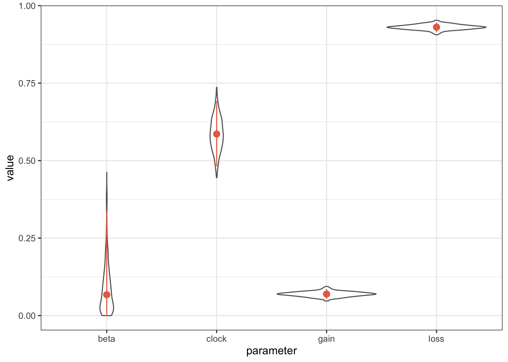
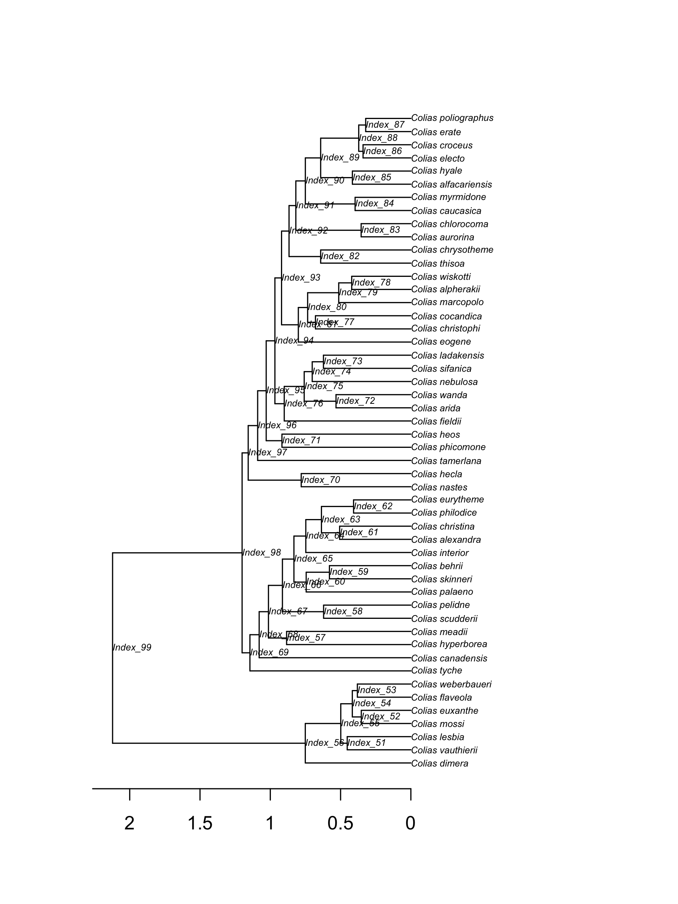
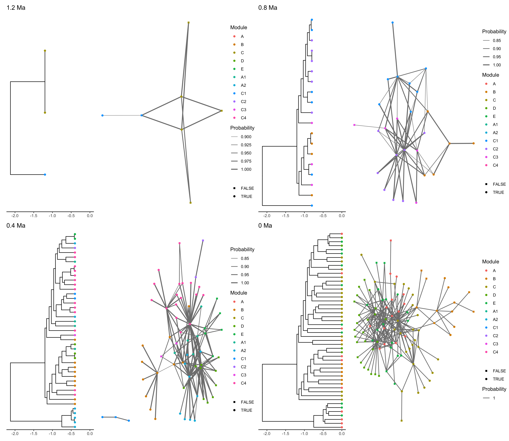
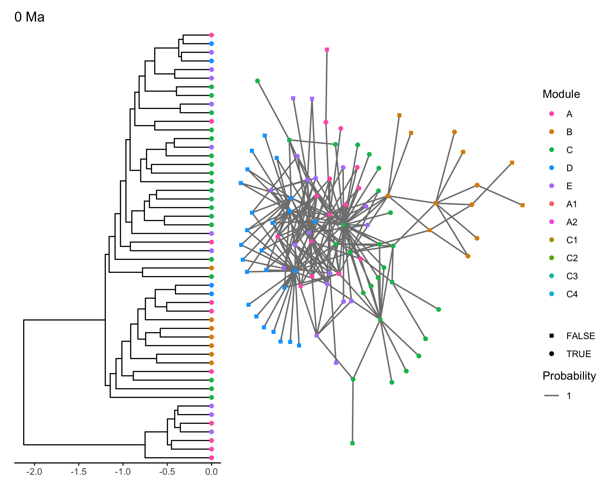
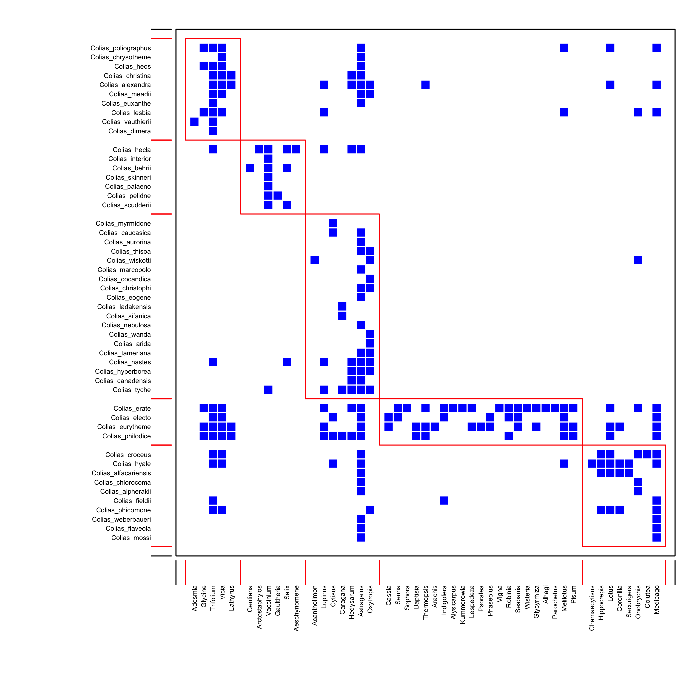
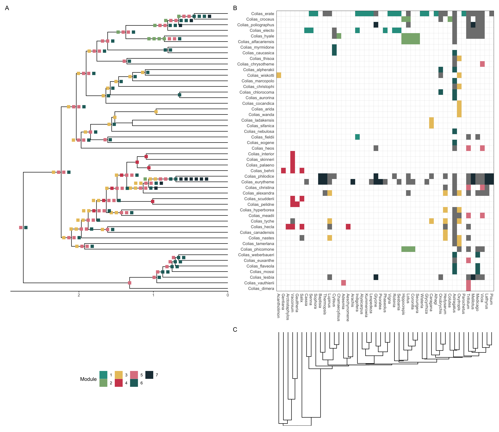

Colias host repertoire evolution
================
Mariana P Braga
13 May, 2022

------------------------------------------------------------------------

Script for analyses performed in … *…*

## Set up

For this script we’ll need *evolnets* to analyze the output posterior
distribution for character history. You can install it from GitHub:

``` r
# install.packages("devtools")
devtools::install_github("maribraga/evolnets")
```

We also need other packages

``` r
library(evolnets)
library(MCMCpack)
library(coda)
library(kdensity)
library(igraph)
library(ape)
library(treeio)
library(ggtree)
library(patchwork)
library(bipartite)
library(tidyverse)
```

## Parameter estimates

The first thing we need to do is to check that independent MCMC chains
have converged to the same posterior distribution. Both chains have
achieved an effective sample size ESS \> 300 for every parameter.

**log files**

``` r
# read files
log1 <- read.table("./R/data/out.4.2s.beta.colias.log", header = TRUE)
log2 <- read.table("./R/data/out.5.2s.beta.colias.log", header = TRUE)

# take only columns of interest
log1 <- log1[,c(1,5:6,8:9)]
log2 <- log2[,c(1,5:6,8:9)]

# give them better names
colnames(log1) <- colnames(log2) <- c("iteration","clock","beta", "gain", "loss")
```

**Convergence test**

``` r
gelman.diag(mcmc.list(as.mcmc(log1), as.mcmc(log2)))
```

    ## Potential scale reduction factors:
    ## 
    ##           Point est. Upper C.I.
    ## iteration        NaN        NaN
    ## clock           1.01       1.05
    ## beta            1.01       1.03
    ## gain            1.00       1.02
    ## loss            1.00       1.02
    ## 
    ## Multivariate psrf
    ## 
    ## 1.01

All values are very close to 1, so we are good to go.

**Parameter estimates**

Now, we can plot the posterior distributions. Since both chains have
samples from the same posterior distribution, we can use only one of the
log files for that.

``` r
parameters <- log1 %>% 
  pivot_longer(cols = 2:5, names_to = "parameter", values_to = "value")

ggplot(parameters, aes(parameter, value)) +
  geom_violin() +
  stat_summary(fun.data = "median_hilow", color = "red", size = 0.5) +
  theme_bw()
```

<!-- -->

``` r
parameters %>% 
  group_by(parameter) %>% 
  summarise(mean = mean(value),
            sd = sd(value))
```

    ## # A tibble: 4 × 3
    ##   parameter   mean     sd
    ##   <chr>      <dbl>  <dbl>
    ## 1 beta      0.0821 0.101 
    ## 2 clock     0.999  0.113 
    ## 3 gain      0.0783 0.0147
    ## 4 loss      0.922  0.0147

## Character history

Let’s move on to reconstruction of the history of evolution of host
repertoire across the Colias phylogeny.

### Data

**Trees**

We use `read_tree_from_revbayes` to read the Colias tree because this
file was exported from RevBayes and contains the node labels given by
RevBayes. This will be very important in the analysis!

``` r
tree <- read_tree_from_revbayes("./R/data/tree_Rev.tre")
host_tree <- read.tree("./R/data/host_tree.tre")
```

**Extant network**

This matrix contains 0s and 2s because in the host repertoire model in
RevBayes, there are 3 possible states (0,1,2), where 1 means “potential
host” and 2 means “actual host”. We used the 2-state model for the
reconstruction in RevBayes, so we are only interested in the 0s and 2s,
no potential host.

``` r
matrix <- read.csv("./R/data/matrix.csv", row.names = 1) %>% as.matrix()
```

**Read in .history.txt files**

We’ll use the *evolnets* function `read_history()` to read a file
outputed from RevBayes with sampled histories during MCMC

``` r
history <- read_history("./R/data/out.4.2s.beta.colias.history.txt", burnin = 0.2)
```

### Number of events and effective rate of evolution

``` r
# Estimated number of events across the Colias phylogeny
count_events(history)
```

    ##       mean HPD95.lower HPD95.upper
    ## 1 281.7337         239         325

``` r
# How many events were host gains and how many host losses?
count_gl(history)
```

    ##    gains   losses 
    ## 122.9537 158.7800

``` r
# Considering the number of events and the total length of the Colias phylogeny, 
# what is the estimated rate of host repertoire evolution?
effective_rate(history, tree)
```

    ##      mean HPD95.lower HPD95.upper
    ## 1 7.44512    6.315834    8.588477

### Extant and ancestral networks

**Time points of interest (ages)**

The first step to reconstruct ancestral networks is to define the time
points during Colias diversification that we want to look at.

``` r
# visually determine interesting time points to reconstruct ancestral networks
plot(tree, show.node.label = T, cex = 0.5)
axisPhylo()
```

<!-- -->

``` r
# choose time points
ages <- c(0,0.4,0.8,1.2)
```

**Interaction probability at given ages**

Now we calculate the posterior probability of interaction between each
host and each extant butterfly at each age in `ages`.

``` r
at_ages <- posterior_at_ages(history, ages, tree, host_tree)
pp_at_ages <- at_ages$post_states
```

**Summarize probabilities into networks**

``` r
# Make binary or weighted networks? Discard interactions with posterior probability < threshold.
# We chose to reconstruct weighted networks with a threshold of 

# ##### temporary fix ######
pp_at_ages <- lapply(pp_at_ages, abind::adrop, drop = 3)
# ###

summary_networks <- get_summary_network(pp_at_ages, pt = 0.8)
```

``` r
# find modules in extant and ancestral networks
modules_at_ages <- modules_across_ages(summary_networks, tree)
#  save R object to be able to use same module configuration in the future
saveRDS(modules_at_ages, "R/R_objects/modules_at_ages_pp80.rds")
```

``` r
# using a saved object
modules_at_ages <- readRDS("R/R_objects/modules_at_ages_pp80.rds")
```

**Plot networks**

``` r
# get the information needed from `modules_at_ages`
matched_modules <- modules_at_ages$matched_modules$nodes_and_modules_per_age

pal <- scales::hue_pal()(11)[c(11,2,5,8,9,1,10,3,4,6,7)]
  
p_nets <- plot_ancestral_networks(summary_networks, matched_modules, tree, palette = pal)
wrap_plots(p_nets$plot, nrow = 2)
```

<!-- -->

``` r
p_nets$plot[[4]]
```

<!-- -->

``` r
mod_ext <- modules_at_ages$original_modules$moduleWeb_objects$`0`
plotModuleWeb(mod_ext, labsize = 0.4)
```

<!-- -->

### Ancestral states at internal nodes of Colias phylogeny

We also wanted to do a tradition ancestral state reconstruction (ASR),
calculating interaction probabilities at internal nodes of the Colias
tree. And now that we have defined modules for the extant network, we
can also use them to group hosts in the ASR.

**Interaction probability at internal nodes**

``` r
at_nodes <- posterior_at_nodes(history, tree, host_tree)
p_asr <- plot_module_matrix2(matrix, at_nodes, tree, host_tree, modules = mod_ext, threshold = 0.9)
p_asr
```

<!-- -->
