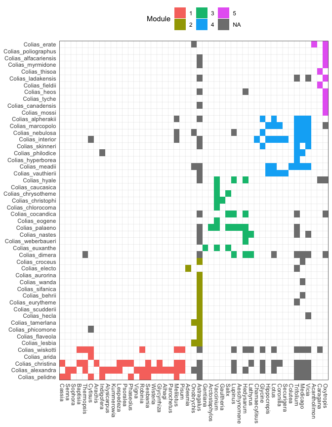

Colias host repertoire evolution
================
Mariana P Braga
26 July, 2022

------------------------------------------------------------------------

Script for analyses performed in … *…*

## Set up

For this script we’ll need *evolnets* to analyze the output posterior
distribution for character history. You can install it from GitHub:

``` r
# install.packages("devtools")
devtools::install_github("maribraga/evolnets")
```

We also need other packages

``` r
library(evolnets)
library(MCMCpack)
library(coda)
library(kdensity)
library(igraph)
library(ape)
library(treeio)
library(ggtree)
library(patchwork)
library(bipartite)
library(tidyverse)
```

## Parameter estimates

The first thing we need to do is to check that independent MCMC chains
have converged to the same posterior distribution. Both chains have
achieved an effective sample size ESS \> 200 for every parameter.

**log files**

``` r
# read files
path_out<- "ignore/2s_new_tree/output/"
log1 <- read.table(paste0(path_out,"out.2.2b.colias.log"), header = TRUE)
log2 <- read.table(paste0(path_out,"out.3.2b.colias.log"), header = TRUE)

# take only columns of interest
log1 <- log1[,c(1,5:6,8:9)]
log2 <- log2[,c(1,5:6,8:9)]

# give them better column names
colnames(log1) <- colnames(log2) <- c("iteration","clock","beta", "gain", "loss")
```

**Convergence test**

``` r
its <- seq(50000,550000,1000)

chain1 <- filter(log1, iteration %in% its) %>% as.mcmc()
chain2 <- filter(log2, iteration %in% its) %>% as.mcmc()

gelman.diag(mcmc.list(chain1, chain2))
```

    ## Potential scale reduction factors:
    ## 
    ##           Point est. Upper C.I.
    ## iteration        NaN        NaN
    ## clock          1.016       1.08
    ## beta           0.999       1.00
    ## gain           1.005       1.01
    ## loss           1.005       1.01
    ## 
    ## Multivariate psrf
    ## 
    ## 1.02

All values are very close to 1, so we are good to go.

**Parameter estimates**

Now, we can plot the posterior distributions. Since both chains have
samples from the same posterior distribution, we can use only one of the
log files for that.

``` r
parameters <- log1 %>% 
  pivot_longer(cols = 2:5, names_to = "parameter", values_to = "value")

ggplot(parameters, aes(parameter, value)) +
  geom_violin() +
  stat_summary(fun.data = "median_hilow", color = "red", size = 0.5) +
  theme_bw()
```


``` r
parameters %>% 
  group_by(parameter) %>% 
  summarise(mean = mean(value),
            sd = sd(value))
```

    ## # A tibble: 4 × 3
    ##   parameter   mean      sd
    ##   <chr>      <dbl>   <dbl>
    ## 1 beta      0.0964 0.0965 
    ## 2 clock     0.723  0.0648 
    ## 3 gain      0.0826 0.00907
    ## 4 loss      0.917  0.00907

**Bayes factor**

The parameter called `beta` defines whether the phylogenetic distance
between hosts affects the probability of gaining new hosts. When
`beta = 0`, phylogenetic distances between hosts do not matter, hence
all hosts are equally likely to be gained. We use Bayes factor to test
whether the inferred `beta` is significantly different from 0. If the
factor is \< 1, it means that the phylogenetic distances do not matter
during host gain events.

``` r
d_prior <- dexp(x=0, rate=1)

kd_beta <- kdensity(x = log1$beta, 
                    kernel='gamma', 
                    support=c(0,Inf), 
                    bw = 0.02)
max = kd_beta(0)

(BF <- d_prior/max)
```

    ## [1] 0.1247874

## Character history

Let’s move on to reconstruction of the history of evolution of host
repertoire across the Colias phylogeny.

#### Data

**Trees**

We use `read_tree_from_revbayes` to read the Colias tree because this
file was exported from RevBayes and contains the node labels given by
RevBayes. This will be very important in the analysis!

``` r
path_data <- "ignore/2s_new_tree/data/"
path_evol <- "ignore/2s_new_tree/evolnets/"

tree <- read_tree_from_revbayes(paste0(path_evol,"tree_final_Rev.tre"))
host_tree <- read.tree(paste0(path_data,"host_tree.tre"))
```

**Extant network**

This matrix contains 0s and 2s because in the host repertoire model in
RevBayes, there are 3 possible states (0,1,2), where 1 means “potential
host” and 2 means “actual host”. We used the 2-state model for the
reconstruction in RevBayes, so we are only interested in the 0s and 2s,
no potential host.

``` r
matrix <- read.csv(paste0(path_data,"matrix_phylo_timetree.csv"), row.names = 1) %>% as.matrix()
```

**Read in .history.txt files**

We’ll use the *evolnets* function `read_history()` to read a file
outputed from RevBayes with sampled histories during MCMC

``` r
history <- read_history(paste0(path_out, "out.2.2b.colias.history.txt"), burnin = 0) %>% 
  filter(iteration %in% its)
```

#### Number of events and effective rate of evolution

``` r
# Estimated number of events across the Colias phylogeny
count_events(history)
```

    ##       mean HPD95.lower HPD95.upper
    ## 1 400.4711         335         462

``` r
# How many events were host gains and how many host losses?
count_gl(history)
```

    ##    gains   losses 
    ## 169.7405 230.7305

``` r
# Considering the number of events and the total length of the Colias phylogeny, 
# what is the estimated rate of host repertoire evolution?
effective_rate(history, tree)
```

    ##       mean HPD95.lower HPD95.upper
    ## 1 5.759065    4.817543    6.643895

#### Modules of the extant (present-day) network

``` r
# find modules
mod <- mycomputeModules(matrix)
```

``` r
mod_list <- listModuleInformation(mod)[[2]]
host_mods <- lapply(mod_list, function(x) data.frame(host = x[[2]]))
host_mods <- dplyr::bind_rows(host_mods, .id = 'host_module')
mod_order <- host_mods$host

para_mods <- lapply(mod_list, function(x) data.frame(parasite = x[[1]]))
para_mods <- dplyr::bind_rows(para_mods, .id = 'parasite_module')
mod_order_para <- para_mods$parasite

plot_extant_matrix(matrix, mod, 
                   parasite_order = mod_order_para, 
                   host_order = mod_order)
```

<!-- -->
