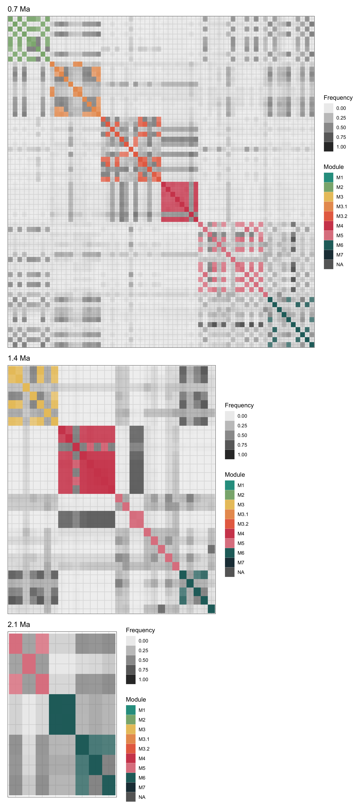

Colias host repertoire evolution
================
Mariana P Braga
15 September, 2022

------------------------------------------------------------------------

Script for analyses performed in … *…*

## Set up

For this script we’ll need *evolnets* to analyze the output posterior
distribution for character history. You can install it from GitHub:

We also need other packages

## Parameter estimates

The first thing we need to do is to check that independent MCMC chains
have converged to the same posterior distribution. Both chains have
achieved an effective sample size ESS \> 200 for every parameter.

**log files**

**Convergence test**

    ## Potential scale reduction factors:
    ## 
    ##           Point est. Upper C.I.
    ## iteration        NaN        NaN
    ## clock          0.997      0.998
    ## beta           1.007      1.037
    ## gain           1.017      1.082
    ## loss           1.017      1.082
    ## 
    ## Multivariate psrf
    ## 
    ## 1.02

    ## iteration     clock      beta      gain      loss 
    ##    0.0000  278.8117  361.0000  361.0000  361.0000

All values are very close to 1, so we are good to go.

**Parameter estimates**

Now, we can plot the posterior distributions. Since both chains have
samples from the same posterior distribution, we can use only one of the
log files for that.


    ## # A tibble: 4 × 3
    ##   parameter   mean      sd
    ##   <chr>      <dbl>   <dbl>
    ## 1 beta      0.0885 0.0834 
    ## 2 clock     0.586  0.0541 
    ## 3 gain      0.0694 0.00810
    ## 4 loss      0.931  0.00810

**Bayes factor**

The parameter called `beta` defines whether the phylogenetic distance
between hosts affects the probability of gaining new hosts. When
`beta = 0`, phylogenetic distances between hosts do not matter, hence
all hosts are equally likely to be gained. We use Bayes factor to test
whether the inferred `beta` is significantly different from 0. If the
factor is \< 1, it means that the phylogenetic distances do not matter
during host gain events.

    ## [1] 0.1204994

## Character history

Let’s move on to reconstruction of the history of evolution of host
repertoire across the Colias phylogeny.

#### Data

**Trees**

We use `read_tree_from_revbayes` to read the Colias tree because this
file was exported from RevBayes and contains the node labels given by
RevBayes. This will be very important in the analysis!

**Extant network**

This matrix contains 0s and 2s because in the host repertoire model in
RevBayes, there are 3 possible states (0,1,2), where 1 means “potential
host” and 2 means “actual host”. We used the 2-state model for the
reconstruction in RevBayes, so we are only interested in the 0s and 2s,
no potential host.

**Read in .history.txt files**

We’ll use the *evolnets* function `read_history()` to read a file
outputed from RevBayes with sampled histories during MCMC

#### Number of events and effective rate of evolution

    ##       mean HPD95.lower HPD95.upper
    ## 1 291.1025         251         345

    ##     gains    losses 
    ## 0.4042326 0.5957674

    ##       mean HPD95.lower HPD95.upper
    ## 1 4.186265    3.609562    4.961351

#### Modules of the extant (present-day) network

### Extant and ancestral networks

**Time points of interest (ages)**

The first step to reconstruct ancestral networks is to define the time
points during Colias diversification that we want to look at.

I’ve chosen 2.1, 1.4, and 0.7, which means 2.1 Ma, 1.4 Ma and 700
thousand years ago.

**Interaction probability at given ages**

Now we calculate the posterior probability of interaction between each
host and each extant butterfly at each age in `ages`.

**Summarize probabilities into ancestral networks**

Make binary or weighted networks? Discard interactions with posterior
probability \< threshold. We chose to reconstruct weighted networks with
a threshold of

**Plot ancestral networks**

<!-- -->

**Plot ancestral networks as matrices**

An alternative way to visualize the networks is by plotting them as
matrices.


**Module validation**

We use modules to facilitate visualisation but sometimes they also have
biological meaning. This step tells us whether the modules in the
ancestral networks are robust across MCMC samples or an artifact of the
summary networks.



    ## $`2.1`
    ##   module      mean  geo_mean
    ## 1     M5 0.7377655 0.7034604
    ## 2     M6 0.6391136 0.5839256
    ## 
    ## $`1.4`
    ##   module      mean  geo_mean
    ## 1     M3 0.6246255 0.5563558
    ## 2     M4 0.8752597 0.8682388
    ## 3     M5 0.3634623 0.2377797
    ## 4     M6 0.5188920 0.3744296
    ## 
    ## $`0.7`
    ##   module      mean  geo_mean
    ## 1     M2 0.4938614 0.1676112
    ## 2   M3.1 0.5004693 0.4183086
    ## 3   M3.2 0.4972053 0.4042709
    ## 4     M4 0.7765755 0.7613942
    ## 5     M5 0.3885626 0.2253195
    ## 6     M6 0.3821607 0.2727022

### Ancestral states at internal nodes of Colias phylogeny

We also wanted to do a tradition ancestral state reconstruction (ASR),
calculating interaction probabilities at internal nodes of the Colias
tree. And now that we have defined modules for the extant network, we
can also use them to group hosts in the ASR.

**Interaction probability at internal nodes**

<!-- -->

``` r
# root state
root_state <- sort(at_nodes$post_states["Index_99",,], decreasing = T)
root_state <- root_state[which(root_state > 0.8)]
root_state
```

    ## Astragalus  Trifolium      Vicia  Oxytropis 
    ##  0.9778393  0.9750693  0.8642659  0.8393352

``` r
# Clade A
cladeA_state <- at_nodes$post_states[paste0("Index_", 51:56),,]
cladeA_state <- cladeA_state[,colSums(cladeA_state) > 0.8]
cladeA_state
```

    ##          Astragalus Trifolium  Medicago
    ## Index_51  1.0000000 0.9279778 1.0000000
    ## Index_52  1.0000000 0.9279778 1.0000000
    ## Index_53  1.0000000 0.9362881 0.9972299
    ## Index_54  0.9307479 0.9972299 0.9889197
    ## Index_55  0.9113573 1.0000000 0.8808864
    ## Index_56  0.8836565 1.0000000 0.7313019

``` r
mrcaA_state <- sort(at_nodes$post_states["Index_56",,], decreasing = T)
mrcaA_state <- mrcaA_state[which(mrcaA_state > 0.8)]
mrcaA_state
```

    ##  Trifolium Astragalus 
    ##  1.0000000  0.8836565

``` r
# Clade B MRCA
mrcaB_state <- sort(at_nodes$post_states["Index_98",,], decreasing = T)
mrcaB_state <- mrcaB_state[which(mrcaB_state > 0.8)]
mrcaB_state
```

    ## Astragalus  Trifolium  Oxytropis      Vicia 
    ##  1.0000000  1.0000000  0.9972299  0.9833795
